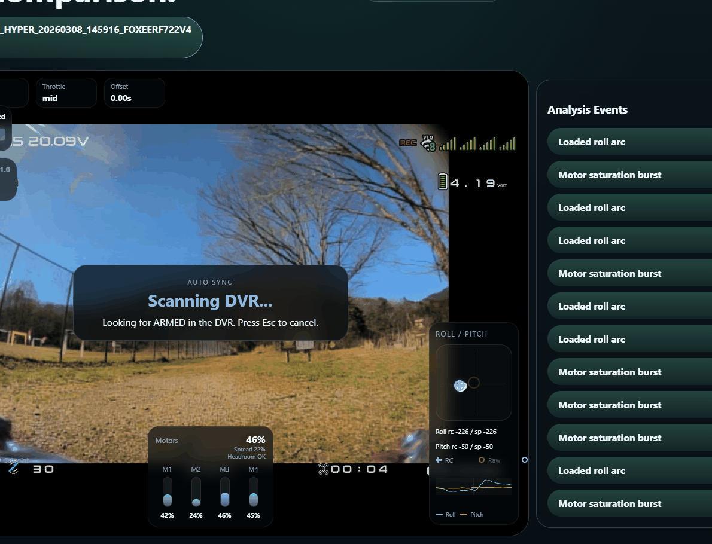

# Blackbox Flight Analyzer

React-first Blackbox analysis app focused on DVR overlays, event-based review, and flight comparison.

## Product stance

This project does not aim to repackage an existing Blackbox viewer UI. The reusable part is limited to log decoding/runtime infrastructure isolated behind the adapter layer. The product value is built in the React app, DVR-first UX, overlay design, event detection, sync workflow, and comparison experience.

## Commands

- `npm install`
- `npm run start`
- `npm run build`

## Structure

- `src/app`: React app shell and Zustand store
- `src/domain`: selectors, derived metrics, events, compare, and sync logic
- `src/vendor/log-core`: isolated log parsing/runtime modules used behind the adapter layer
- `docs`: migration and architecture notes

## Notes

- This repo is the standalone continuation of the React-first MVP.
- Third-party derived log/runtime code is intentionally isolated behind `src/domain/blackbox/adapter`.
- Licensing and attribution details are documented in `NOTICE.md` and `LICENSE`.
- A single `.BBL` may surface as multiple selectable flight tabs when it contains multiple readable log sections.
